<h3><code>can@github ~ $ whoami</code></h3>

<table>
  <tr>
    <td valign="top"></td>
    <td valign="top"></td>
  </tr>
</table>

 

<h3><code>can@github ~ $ ./contributions.sh</code></h3>

  

<h3><code>can@github ~ $ ./links.sh</code></h3>

<b>Can Dumanlı · Cloud &amp; DevOps Engineer</b>

  

  

<h3><code>can@github ~ $ ls ./stack</code></h3>

  

<h3><code>can@github ~ $ cat certs.txt</code></h3>

  

<h3><code>can@github ~ $ ls ./projects</code></h3>

| | Project | What it is |
|:-:|---|---|
| 🛡️ | **[azure-enterprise-network](https://github.com/Elxeoo/azure-enterprise-network)** | Secure air-gapped AI infrastructure on Azure with a Zero-Trust network topology. |
| ⚡ | **[aks-cilium-ebpf-lab](https://github.com/Elxeoo/aks-cilium-ebpf-lab)** | Private AKS cluster powered by the Cilium eBPF overlay network. |
| 🚀 | **[enterprise-gitops-argocd](https://github.com/Elxeoo/enterprise-gitops-argocd)** | Enterprise GitOps platform with automated reconciliation. |

